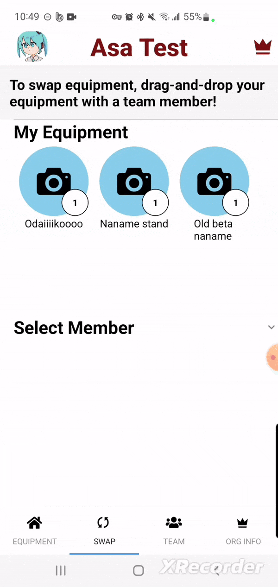
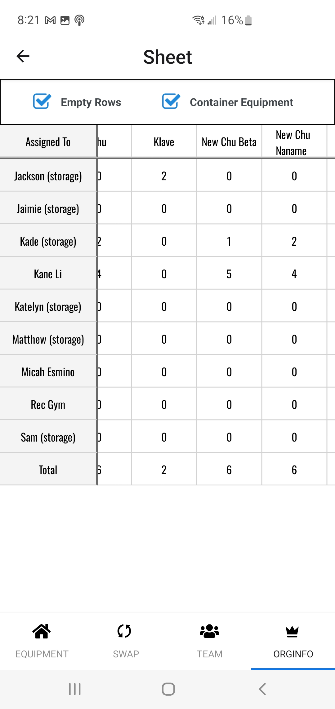
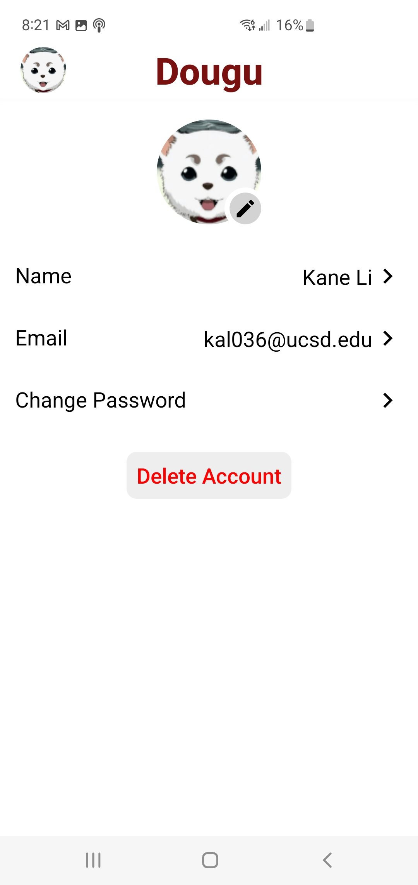

# Dougu

Dougu is an equipment management app that seeks to make tracking and transferring equipment as simple as possible through drag and drop features. This project was born out of a need to manage equipment quickly in offline scenarions for the Asayake Taiko organization at UC San Diego.

  
  
  

  
#### *Preview displaying drag and drop transfer of equipment, an equipment list for an organization, and an organization member information page*

The app was designed by [Neela Kolte](https://www.behance.net/neelakolte), and these are some words from her:

> "Kane and I designed Dougu to assist with keeping track of our taiko club's equipment as it was strewn about the city in our club members' cars. When I approached Kane, he already had a basic digital wireframe. I fleshed out his design to prioritize ease of access to self and team equipment, the most frequently used aspects based on how we redistributed equipment after practices. The sheer amount of equipment drivers and equipment was challenging to put on one page without becoming overwhelming for the user, so I designed a horizontal and vertical scrolling list with icons to simplify it

[Figma Link](https://www.figma.com/design/oueylwCfjtJhR9WHHlBp3d/Untitled?node-id=0-1&t=kpmzdnMqWr8Gefp4-1)

# Contributing

This app is currently in testing for both Google Play Console and App Store. It is planned to release around December, as I would like to some testing in before publishing a production build. Right now, if you want to contribute, please email me at [kal036@ucsd.edu](kal036@ucsd.edu) and I may help you setup the Amplify development environment for this project.
