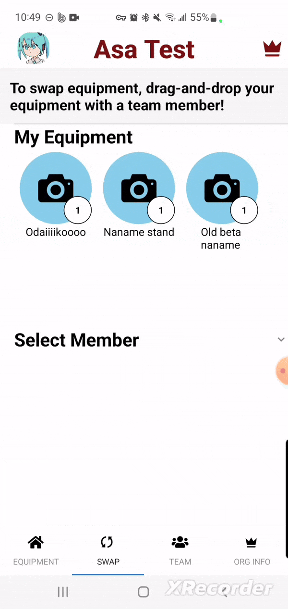
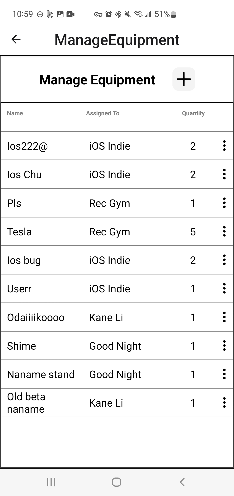
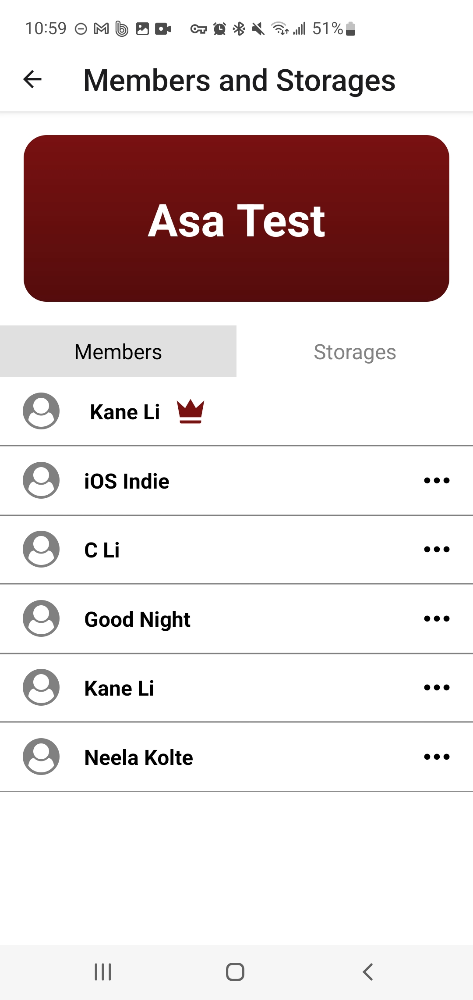

# Dougu
Dougu is an equipment management app that seeks to make tracking and transferring equipment as simple as possible through drag and drop features. This project was born out of a need to manage equipment quickly in offline scenarions for the Asayake Taiko organization at UC San Diego.

  
  
  

  
#### *Preview displaying drag and drop transfer of equipment, an equipment list for an organization, and an organization member information page*

This app was designed by [Neela Kolte](https://www.behance.net/neelakolte) and implemented by me. Here are some words from her: "Kane and I designed Dougu to assist with keeping track of our taiko club's equipment as it was strewn about the city in our club members' cars. When I approached Kane, he already had a basic digital wireframe. I fleshed out his design to prioritize ease of access to self and team equipment, the most frequently used aspects based on how we redistributed equipment after practices. The sheer amount of equipment drivers and equipment was challenging to put on one page without becoming overwhelming for the user, so I designed a horizontal and vertical scrolling list with icons to simplify it. Overall, I designed the app with readability and gaining information quickly in mind, since post-practice can be a bit of a rush."

# Contributing
This app is currently in internal testing on Google Play Console and Apple Teststore. After a round of testing with members within the organization, the app will likely be optimized and set to release around July or August. This app was mainly built with Expo Go, React Native, and AWS Amplify. To contribute, make sure you have Expo go and Amplify CLI configured. Then, you can install dependencies with `npm install`, setup Amplify [link](https://docs.amplify.aws/react-native/start/) (Make sure you use V5), and then run using npx expo start. 

Future features:
- Push notifications notifying users when a change has been made to the equipment they carry
- Swappable containers with equipment inside that can be dragged in and out of the container
- Profile images for organizations, equipment, and users for customizability
- Requests task, where organization managers can specify expected equipment configurations and require users to confirm
- Profile page for users
